# Payment Service System Diagrams

## 🏗️ High-Level Architecture

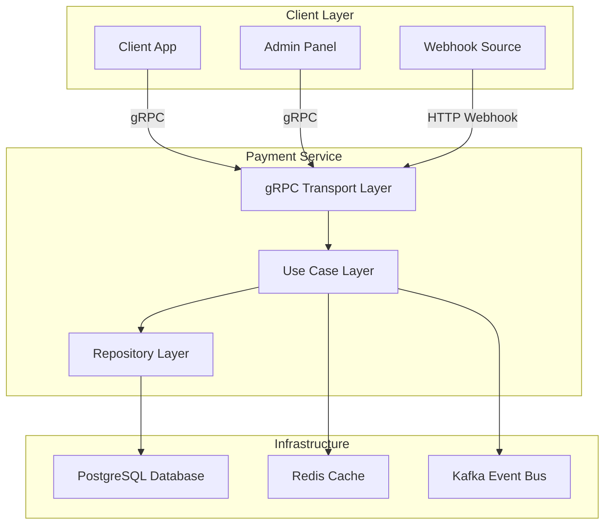

## 💳 Payment Flow

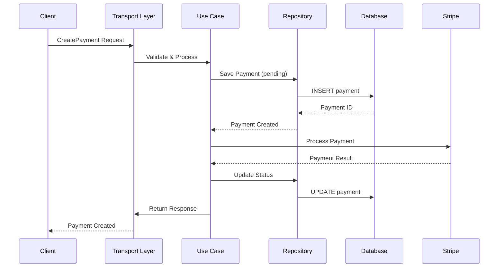

## 🎫 Entitlement System

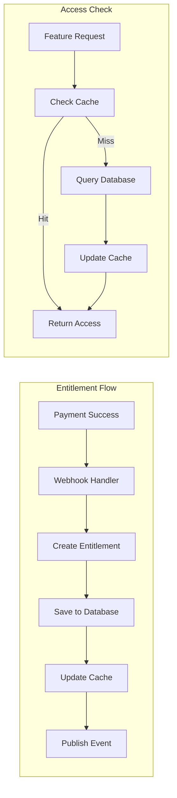

## 💰 Pricing Zone System

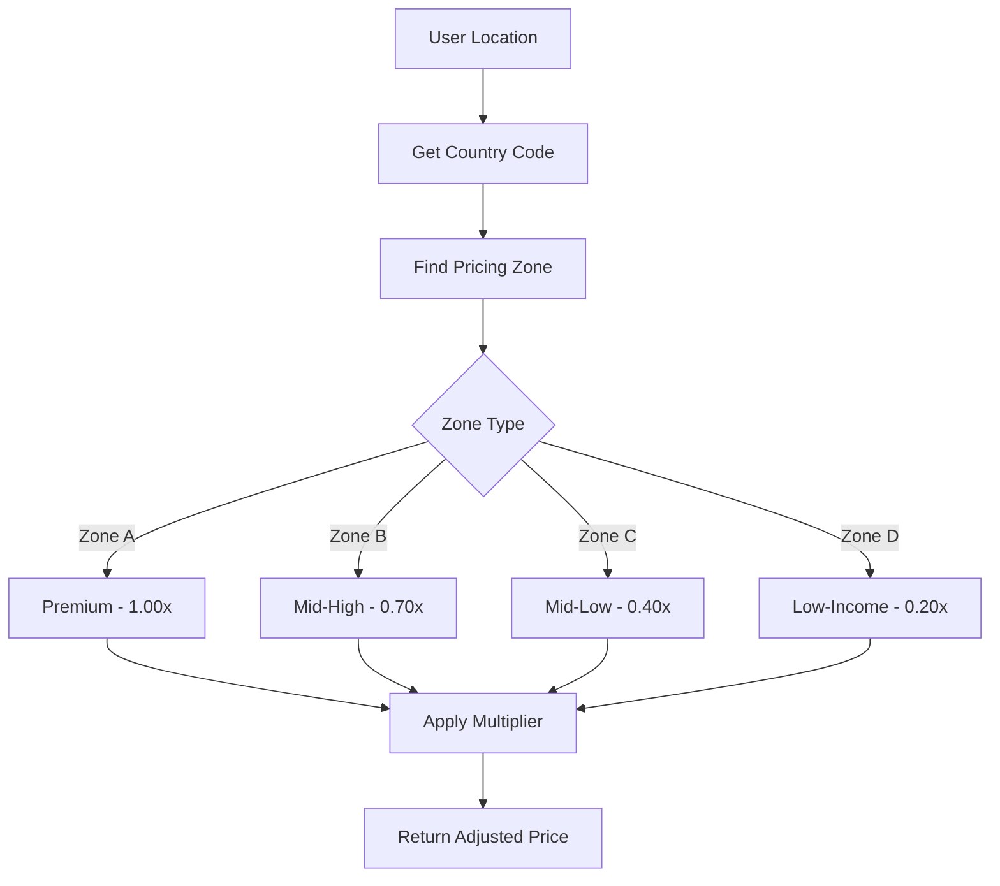

## 🗄️ Database Schema

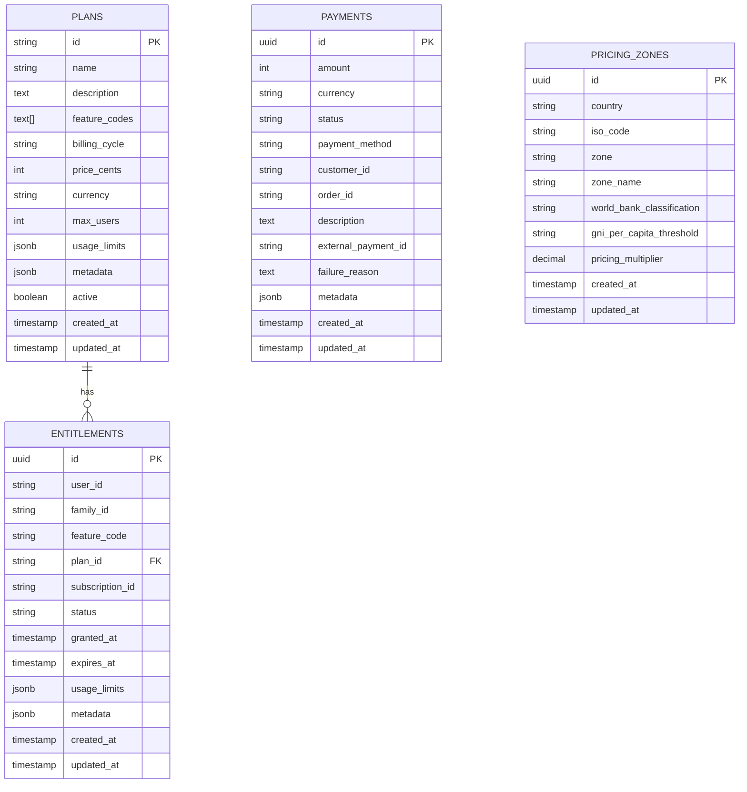

## 🔐 Authentication Flow

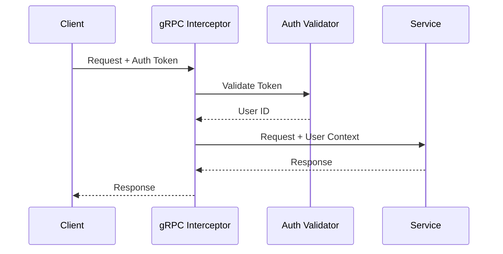

## 📡 Event System

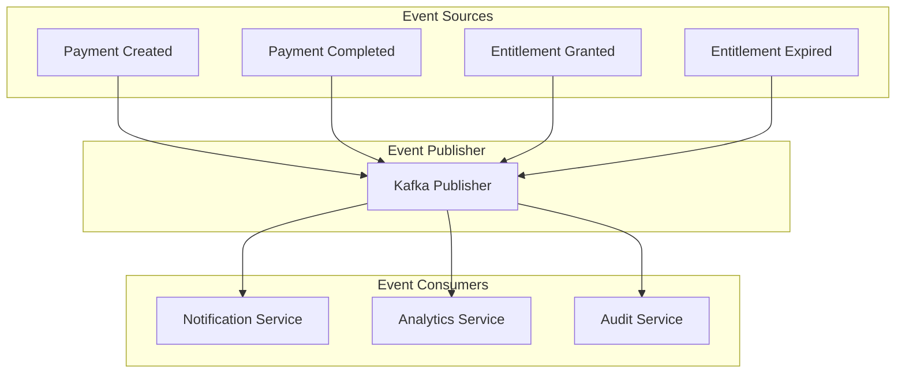

## 🏛️ Clean Architecture Layers

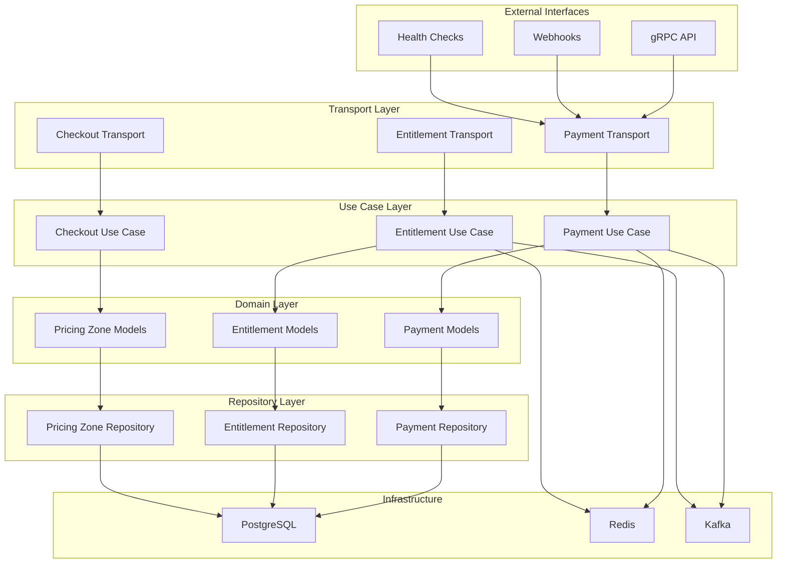

## 🔄 Request Flow

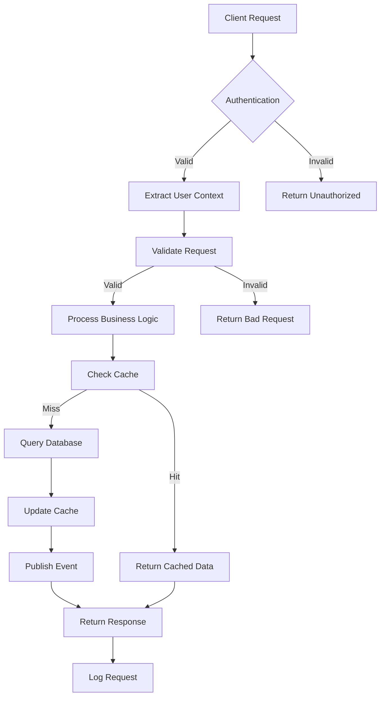

## 📊 Service Health Monitoring

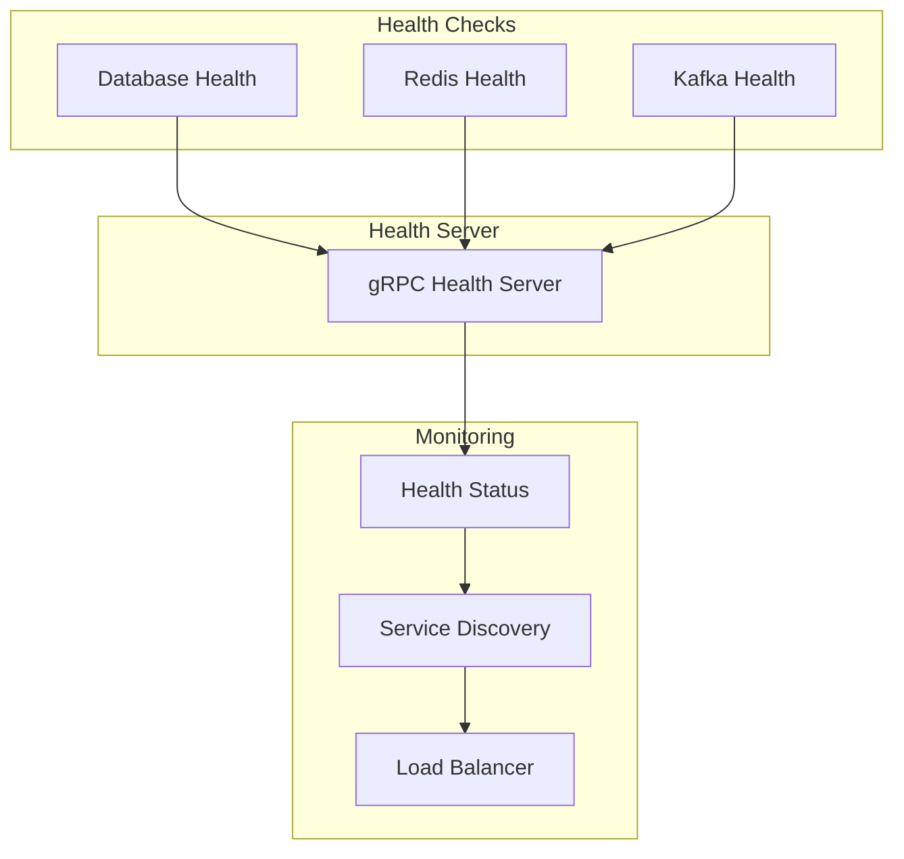

## 🚀 Deployment Architecture

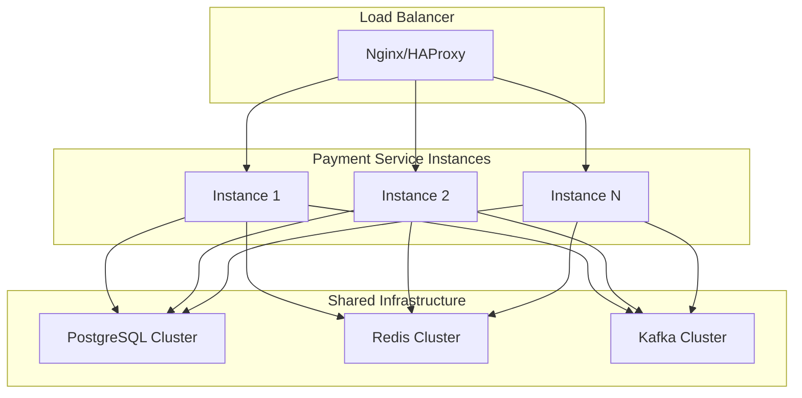

---

## 📝 How to Render These Diagrams

### Option 1: GitHub
- GitHub automatically renders Mermaid diagrams in markdown files
- Just view this file on GitHub

### Option 2: Mermaid Live Editor
- Go to https://mermaid.live/
- Copy and paste any diagram code
- Export as PNG/SVG

### Option 3: VS Code Extension
- Install "Mermaid Preview" extension
- Open this file and use the preview

### Option 4: Command Line
```bash
# Install mermaid-cli
npm install -g @mermaid-js/mermaid-cli

# Generate PNG
mmdc -i SYSTEM_DIAGRAMS.md -o diagrams.png

# Generate SVG
mmdc -i SYSTEM_DIAGRAMS.md -o diagrams.svg
```

---

*These diagrams provide a comprehensive visual representation of the Payment Service architecture, data flow, and system interactions.*
